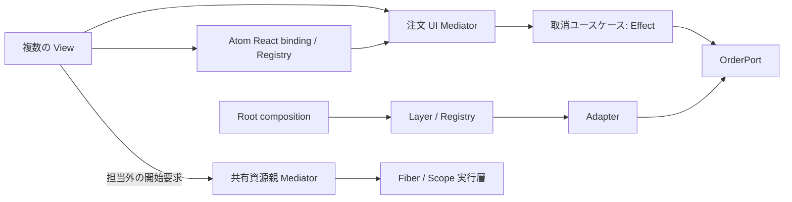

# A — Effect / Atom の新規構成: 設計メモ

## Deliverable

注文取消を次の最小構成で組み立てる。専用 Mediator class、独自 runtime／scheduler、`isSubmitting` や pending/result の複製は作らない。

- **Model／ユースケース**: `cancelOrder` は React・Atom を参照せず、実行時に永続的な注文状態を確認する。発送済みなら型付きの業務エラーで拒否するため、画面表示後に発送へ変わっても取消は通らない。必要な `OrderPort` を Effect の依存として要求し、Adapter は Port を実装、Root で Layer を供給する。
- **注文 UI Mediator**: Model の可否と Atom binding の実行状態から表示・再試行・取消方針を決める。binding が試行 ID と古い結果の除外を保証するならそれを利用する。保証しない場合だけ、表示採用用の `acceptedCancelAttemptId[orderId]` をここで持ち、Atom の結果を ID 一致時だけ表示へ採用する。pending/result 自体は Registry のものを導出する。
- **共有資源親 Mediator**: 競合する画面フローだけを裁定する。状態は `idle | owned(owner) | releasing(owner, nextIntent)`。子は自分で相手を止めず、開始要求を親へ委譲する。親は停止を決め、実行層から当該 owner の終了・解放通知を受けてから `nextIntent` を開始する。独立フローにこの親は置かない。
- **実行層／binding**: Effect の実行、Fiber の中断、Scope による資源解放を既存の実行境界と Atom Registry に接続する。中断はサーバー上の取消処理を巻き戻す保証ではない。想定内の業務失敗は型付きエラーとして Effect で合成し、defect と中断は業務エラーへ変換しない。
- **View**: この課題の緩和した Passive View では複数 View が同じ Atom を購読し、同じ Mediator の要求口を呼べる。入力値・形式検査、表示整形、tooltip の開閉は局所に置く。厳密な Passive View が必要なら、Atom を読む接続部分と props／イベントだけの表示部分を分離する。View に発送可否、排他、他 View の停止を置かない。

静的な依存は `ユースケース → Port`、`Adapter → Port`、`View → binding/Mediator → ユースケース` とし、Root だけが具体 Layer／Adapter を選ぶ DAG にする。失敗から再試行への遷移は時間上の循環であり、import 循環にはしない。CoR は子から共有資源親への担当外要求だけに使い、子で処理済みの業務処理やエラー合成を親で再実行しない。ROP は Effect の成功値と型付き失敗の合成に限り、常時の二重 `Result` は作らない。

### 検証案（未実行）

| ケース | 操作 | 期待値 |
| --- | --- | --- |
| 発送競合 | 未発送表示の注文を取消要求する直前に発送済みにする | ユースケースの実行時検証が型付き業務エラーで拒否し、UI はその結果を表示する。 |
| 再試行と古い応答 | 同じ注文で試行 A を中断または失敗後に試行 B を開始し、A の成功・失敗を遅れて返す | binding の保証または `acceptedCancelAttemptId` により A は B の pending/result／表示を変えない。 |
| 終了待ち排他 | フロー X 使用中に競合フロー Y の開始を要求する | 親は X を `releasing` に保ち、X の終了・資源解放通知前に Y を開始しない。中断要求だけでは Y を開始しない。 |
| 複数購読と局所状態 | 二つの View が同じ注文状態を購読し、片方で tooltip を閉じる | 両 View の業務判断は同じ Mediator に届き、tooltip の変化は局所表示だけに留まる。 |

## 各基準

| 基準 | 判定 | 理由 |
| --- | --- | --- |
| 1 | ○ | 発送済み取消の規則と実行時検証を React／Atom 非依存のユースケースに置く。 |
| 2 | ○ | Effect の型付きエラー、Service／Layer、Fiber／Scope と Atom Registry を使い、同一の pending/result や runtime を重ねない。 |
| 3 | ○ | Mediator は判断の役割であり、必要な追加状態だけを持つ。排他と終了待ちは競合フローの共通親だけが扱う。 |
| 4 | ○ | static import は DAG、再試行は時間上の遷移として分離する。CoR は担当外要求の委譲だけで、Effect が業務・エラーを合成する。 |
| 5 | ○ | 複数購読を許す緩和版と、connector と表示部を分ける厳密版を区別した。 |
| 6 | ○ | 期待された業務失敗を Effect の型付きエラーで合成し、二重 Result 化と defect／中断の偽装を避ける。 |
| 7 | ○ | 発送競合、古い応答、解放待ちを検証案へ含め、いずれも未実行と明記した。中断のサーバー巻戻しは主張しない。 |

## YOUR Trace

allOK

- **Understanding**: 課題 A の必須条件と、Effect／Atom の適用参照を読み取った。
- **Planning**: 既存 binding から導出できる状態と、結果採用・終了待ちにだけ必要な追加裁定状態を分けた。
- **Execution**: 実アプリ、抽象実行モデル、フレームワーク API コードを作らず、設計メモだけを作成した。
- **Formatting**: 日本語の Markdown に、Deliverable、基準判定、検証案、入力記録を収めた。

## Unclear

| Issue | Cause | General Fix Rule |
| --- | --- | --- |
| 導入済み Atom binding が試行 ID と古い結果除外をどこまで保証するか | 課題には現行 API・実装がない | 導入版の Registry／binding の保証を確認し、足りないときだけ Mediator に表示採用用 ID を一つ追加する。 |
| 共有資源の具体的な解放完了通知 | 資源種別と既存実行境界が未指定 | 実行層が終了・解放を観測できる通知を返し、親はその通知まで次の開始を待つ。 |

## 任意補完

`acceptedCancelAttemptId` は検査用の採番ではなく、古い応答を表示へ採用しない本番判断に必要な場合だけ保持する。binding が同じ保証を持つと確認できた時点で削除する。

## YOUR Retries

やり直し 0 回。課題条件と参照の責務分担で設計を確定できた。

## INPUT

- target `local-skills/mvp-mediator-architecture/SKILL.md`: `050c87041aecc5bf04e24f425f56e01d0e10dc4c9d46ecc9d9f50dcf98eec0fb`
- 実読 reference: `local-skills/mvp-mediator-architecture/references/tanstack-effect.md`
