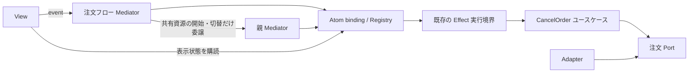

# A — Effect / Atom の新規構成: 設計メモ

## Deliverable

### 採用範囲と責務

注文取消は `CancelOrder` ユースケース（Model）に置く。注文の現在状態を取得した上で「発送後は取消不可」を実行時にも判定し、取消を実行する。React と Atom はこのユースケースに依存させない。発送済みなら `OrderAlreadyShipped`、権限なしなら `CancellationForbidden` のような想定内エラーを Effect の型付きエラーで返す。通信不能も必要なら別の型付きエラーにする。defect と Fiber の中断は業務エラーに変換しない。

ユースケースは必要な注文取得・取消の Port だけを Effect の Service として要求し、具体 Adapter は組立箇所の Layer で供給する。静的依存は `ユースケース → Port` と `Adapter → Port` に保ち、React 側は組立済みの UI binding を使う。各関数を形式的な Service にせず、この外部依存境界だけに留める。

`@effect/atom-react` の Registry と Atom binding を、画面で共有する取得・取消の pending/result、購読、実行の所有者にする。複数 View は同じ Atom を購読してよい。注文フローの Mediator は純粋な裁定関数または既存 Atom の更新処理で足り、専用 class、store、reducer、runtime、scheduler は作らない。取消成功後の一覧更新も、既存のキャッシュ無効化・再取得機構へ接続する。

Mediator が必要に応じて持つのは、binding では表せない UI 方針だけである。同じ注文の再試行を選んだ場合は、binding が操作識別と結果除外を保証するかを確認して共用する。不足するときだけ、Mediator が「現在採用する試行 ID」を持ち、pending/result 自体は binding から導出する。試行 A を停止して試行 B を開始した後の A の成功・失敗は、B の表示に採用しない。

別画面フローの共有資源には、その競合するフローだけの共通親 Mediator を置く。親は `idle`、`stopping(旧所有者, 待機要求)`、`active(所有者)` という最小の裁定状態を持つ。子は自分だけで決められる操作を処理し、共有資源の開始・切替だけを親へ委譲する。親は旧フローの停止を実行層へ依頼し、Fiber の終了と Scope による資源解放の完了通知を受けてから待機側を開始する。停止要求を送った時点では開始しない。中断はサーバー上の取消や外部処理の巻戻しを保証しない。

矢印は静的 import とイベント通知を同一視しない。組立箇所が Adapter の Layer、Registry、親子 Mediator の通知口を供給し、下位から上位へはイベント引数または Context 経由で通知するため、依存グラフは循環させない。失敗から再試行への時間上の遷移は循環してよい。業務処理と型付きエラーの合成は Effect に置き、CoR は担当外の共有資源要求の委譲にだけ使う。

緩和した Passive View では、View が Atom を直接購読し、tooltip、展開状態、入力値、形式チェックなど局所表示状態を持てる。ただし取消可否、他フローの停止、進行中操作の扱いは Mediator へイベントとして送る。厳密な Passive View が必要な箇所は、Atom を読む接続部分と、props とイベントだけを受ける表示部分を分ける。複数の接続部分が同一 Atom を読むことは許容する。

### 検証案（未実行）

1. 発送前として画面を表示した後、サーバー側で発送済みに変えて取消を実行する。ユースケースが `OrderAlreadyShipped` を返し、UI はその型付きエラーを表示することを確認する。
2. 同じ注文で取消試行 A を開始し、停止後に試行 B を開始する。A の成功・失敗を B より後に到着させ、B の pending/result と表示が A で上書きされないことを確認する。
3. フロー X が共有資源を使う間にフロー Y の開始を要求する。X の停止依頼だけでは Y を開始せず、X の Fiber 終了と Scope の解放完了通知後にだけ Y を開始することを確認する。
4. 二つの View が同じ取消状態を購読し、一方の tooltip を閉じても、他方の表示・取消操作・共有資源の裁定が変化しないことを確認する。

## 基準対応

| 基準 | 判定 | 理由 |
| --- | --- | --- |
| 1 | ○ | 発送後不可を React/Atom 非依存の Model/ユースケースで実行時検証し、UI は判定を再実装しない。 |
| 2 | ○ | 型付きエラー、Service/Layer、既存の Effect 実行境界、Fiber/Scope を使い、独自 runtime/scheduler と pending/result の複製を置かない。 |
| 3 | ○ | Mediator は最小の UI 裁定であり、通常は純粋関数または binding 更新で足りる。共有資源の排他と終了待ちだけを共通親が持つ。 |
| 4 | ○ | import 依存を DAG に保ち、再試行の時間上の循環を許す。CoR は親への委譲だけ、Effect は業務処理とエラー合成を担当する。 |
| 5 | ○ | 緩和した Passive View の複数購読・局所状態と、厳密版の connector/表示分離を明記した。 |
| 6 | ○ | ROP を Effect の成功・型付き失敗の合成として扱い、二重 Result 化と defect/中断の業務エラー化を避けた。 |
| 7 | ○ | 発送競合、試行 A/B の古い応答、終了・解放待ちを具体的な未実行検証として記録し、中断の巻戻し保証を主張していない。 |

## YOUR Trace

| 区分 | 結果 |
| --- | --- |
| Understanding | OK: 課題の対象を注文取消、複数購読、再試行、終了待ちを伴う共有資源に限定した。 |
| Planning | OK: 既存 binding が表す状態と、親 Mediator が追加で裁定すべき状態を分離した。 |
| Execution | OK: 設計メモのみを作成し、実アプリ、抽象実行モデル、フレームワーク API コードを作成していない。 |
| Formatting | OK: Deliverable、基準判定、検証の未実行、入力、再試行を記載した。 |

## Unclear

| 項目 | 内容 |
| --- | --- |
| Issue | なし。 |
| Cause | なし。 |
| General Fix Rule | 実装時に導入済み binding が操作 ID・古い結果除外・中断完了をどこまで保証するか確認し、不足する裁定状態だけを追加する。 |

## 任意補完

一覧取得と取消は別の Atom 状態にする。再取得が取消の pending/result を初期化しないことを、Atom の共有範囲と寿命の設計時に確認する。

## YOUR Retries

やり直し: 0 回。課題の必須条件とスキルの責務分担が最初の設計で整合したため。

## INPUT

- 対象 SKILL.md SHA-256: `050c87041aecc5bf04e24f425f56e01d0e10dc4c9d46ecc9d9f50dcf98eec0fb`
- 実読した条件付き reference: `local-skills/mvp-mediator-architecture/references/tanstack-effect.md`（React / Effect / `@effect/atom-react` を使う課題のため）
